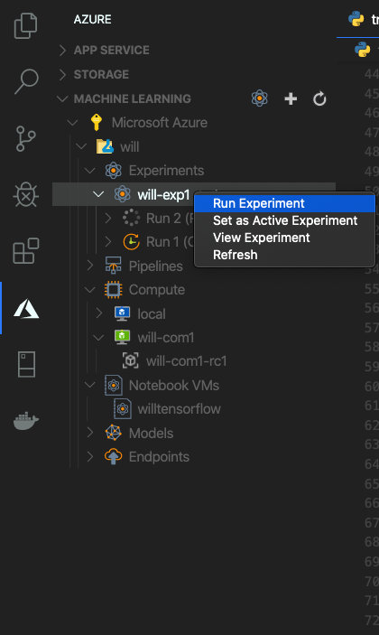
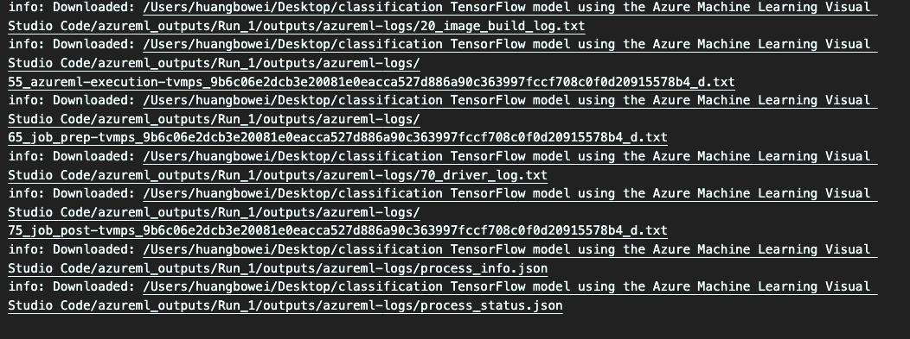
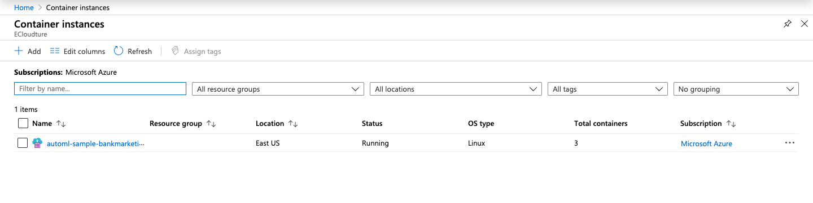

# Build TensorFlow model using the Azure Machine Learning Visual Studio Code

## Scenario 

The tutorial uses **TensorFlow** to train an image Classification model that categorizes from minist datasets,by creating a neural network that takes the image as input and outputs a list of 10 probabilities

 ## Prerequisite

> Install [Visual Studio Code](https://code.visualstudio.com/)

>Download **All folder**  which is in this repository in your computer folder 

## Install the extension

1-1. Open Visual Studio Code

1-2. Select **Extensions** icon from the **Activity Bar** to open the Extensions view

    

1-3. In the Extensions view, search for **Azure Machine Learning** .

1-4. Click **install**

    

## Sign in to Azure Account

In order to provision resources and run workloads on Azure, have to sign in with  Azure account credentials

2-1. Open the command palette by selecting **View** > **Command Palette** from the menu bar

    

2-2. Enter the command `Azure: Sign In` into the text box to start the sign in process

    

2-3 Select your Azure Account

    

2.4 Successfully sign in VS code

    

## Open file in VS code 

3-1. Open to file by **File**> **Open folder**

    

3-2 Select **main.Folder** in VS code

    

## Create workspace

4-1. On the VS code activity bar , select the Azure  to open the Azure Maching Learning view.

4-2. Select your Azure subscription.

4-3. Right-click your Azure Subscripition and select **Create Workspace**

    

4-4. Input Azure ML workspace 

*  Name: input `your name`

* Resource group : Select `your resource group`

* Workspace SKU : Select `Basic`

After a few minutes, the new workspace appears in your subscription node

## Create experiment

5-1. Expend the **your workspace**

5-2. Right-click the **Experiments**

5-3. Select **create Experiment** 

    

5-4. In the Command plaette prompt

* Subscription: Select `your  Subscription`

* Workspace: Select `your Workspace`

* name: Input `your name-exp1`

5-5. Press **Enter** to create the new experiment

After a few minutes, the new Experiment appears in your **Experiments** node of your workspace

    

##  Create  compute Target

A **compute target** is the computing resource or environment where you run scripts and deploy trained models

6-1. Under the workspace node , right-click the **Compute** node and choose **create compute**

    

6-2. In the  Command plaette prompt

* Compute type: Select `Azure Machine Learning Compute (AmlCompute)`

* VM size: Choose `Standard_D1_v2`

* Compute name : Input `your name-com1`

After a few minutes, the new compute target  appears in your **Compute** node of your workspace.

    

##  Create a run configure 

 Submit a training run to a compute target, you also submit the configuration needed to run the training job.

 7-1. Under the workspace node ,**right-Click** `your Compute target` and choose Create Run Configuration.

 

    

 7-2. In the Command plaette prompt

 * Name : `Your name-com1-rc1`

 * Type of training job : Choose`Tensorflow Single-Node Training`

 * Script to run: **Enter** to browse the script file to run on the compute , script to train the model is the `train.py` ,field inside the `main/train.py`

    

 7-3. **Enter** the following into the command palette prompt to specify the required packages.

> pip: azureml-defaults; conda: python=3.6.2, tensorflow=1.15.0

    

7-4. The file appears in VS Code with content ,and then  **Click**  `Save and continue` 

    

## Train the model

During the training process, a TensorFlow model is created by processing the training data and learning patterns

8-1. Expend the **your workspace**

8-2. Right-click the **your Experiments**

8-3. Select **Run Experiment**

    

8-4. In the Command plaette prompt

* Compute : Choose `your AmlCompute`

* Configuration : Choose `your  name-com1-rc1`

8-5. Track the progress of your experiment, right-click the current run node and select View Run in Azure portal

    

8-6. Requesting to open an external website appears, select**Open**

    

## View train result

You can see train status and processing in Azure Machine Learning Studio, and wait train status is complete 

    

9-1.  Visually 

    

9-2.  Table

    

## Register the model 

Now have trained model ,can register model in workspace

10-1. Get the model outputs from training the model , Right-click the **Run1** run node and select **Download outputs**

    

    

10.2 output appear downloaded detail

    

10-3. Right-click the **Models** node and choose **Register Model**.

    

10-4. In the Command plaette prompt 

* Name :input`your name-mod1`

* model path format : Choose `model folder` ,and select `outputs/model` diectory

    

10-5. File contain model configure with content

    

10-6. Click **Save and continue**

After a few minutes, the model appears under the **model** node.

    

## Deploy the model 

In VS Code ,you can deploy model as a web service to:

* Azure Container Instance (ACI)

* Azure Kubernetes Service (AKS)

11-1. Expend the **Model** node

11-2. Right-Click the `your register model name` and  select **Deploy service from Registered Model**

    

11-3. In the command platte:

* Service type: Choose **Azure Container Instance**

* Name :Input `your name-svc1`

* Script to run in Container:  **Enter** in the command palette and choose `main/score.py`in the directory

* Conda dependency description file: **Enter** in the command palette and choose `main/env.yml`in the directory

11-4 File contain model configurations with content, and click **Save and continue**

    

A request is sent to Azure to deploy your web service, after a few minutes ,the new service appears under the **Endpoints** node 

## View ACI status in Portal

 12-1. Sign in to the Azure portal ,and in the upper-left corner of Azure portal, select **Container Instance**.

 

    

12-2. Click **Container Instances Name**

    

12-3. In the upper-left corner of Azure container Instances, select **Container**

    

12-4. Monitor  Containers state

    

###  Conclusion

Congratulations! You now have learned how to:

* Create ML workspace

* Create an experiment

* Create compute target

* Run a configuration file

* Train a model

* Register a model

* Deploy a model

### Clean up Resource

In the resource group,**Delete resource**

1. Azure Machine Learning Service workspace

2. Azure Container instance

3. other Serice 