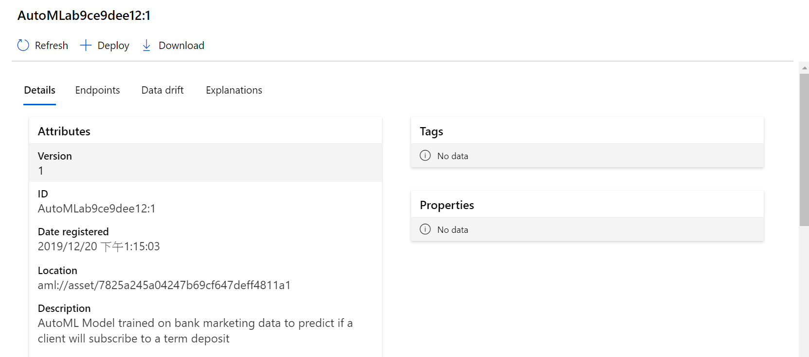
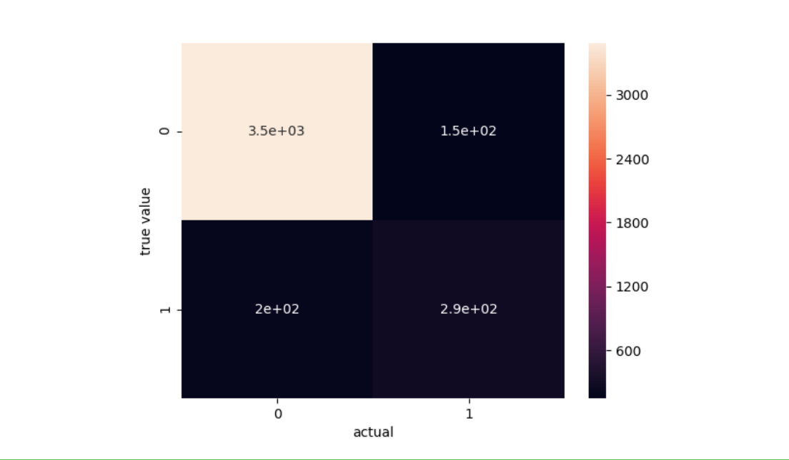

# Automated Machine Learning on Azure NotebookVM

## Scenario 

In this Lab , we use the UCI Bank Marketing dataset to showcase how can use [AutoML on Azure Notebook VM](https://docs.microsoft.com/en-us/azure/machine-learning/service/concept-automated-ml) for a classification problem and deploy it to an [Azure Container Instance (ACI)](https://docs.microsoft.com/en-us/azure/container-instances/container-instances-overview). The classification goal is to **predict if the client will subscribe to a term deposit with the bank**.

    

## Prerequisite

* Download **bank-market-classification folder**  which is in this repository in your computer folder 

* Include three **datasets** and one **.Ipynb** file

### Create a workspace
An Azure Machine Learning workspace is a foundational resource in the cloud that you use to **experiment, train, and deploy machine learning models**.

1. Sign in to the Azure portal ,and in the upper-left corner of Azure portal, select **Create a resource**.

    

2. Use the search bar to find **Machine Learning service workspace**,and click **Select**.

    

3. In the Machine Learning service workspace pane, select **Create Azure machine learning** to begin.

    

4. For Workspace name, type a **Unique Name**

5. For Subscripition, Select **your Subscripition**

6. For Resource group , Select **your Resource group** ,if not have any, Please click **Create New**

7. For Location , Select **East US**  

8. For Workspace edition, Select **Basic**

9. After you are finished configuring the workspace, select **Review+Create**.

    

10. To view the new workspace, select **Go to resource**.

## Create NotebookVM

 1. In the upper-left corner of Azure Machine , Select **Compute**, and click **NEW** in Notebook VMs.

    

    

2-1. In Notebook VM , type :

*  Notebook VM name : `your unique name`
*  VM type : Select **STANDARD_D1**

2-2  Click **Create**

    

 * Wait about 5 minutes ,and status to **Running**

    

 3. Click **jupyter** and into jupyter Environment page

  

    

4. Authenticate Account
    
    * Select your Azure account

    

    

5. Upload **bank-market-classification.ipynb**

   
    * Click **upload**, and Select **bank-market-classification.ipyn** from  your computer folder

    

### Setup

As part of the setup  have already created an Azure ML Workspace object. For AutoML  will need to create an Experiment object, which is a named object in a Workspace used to run experiments.

1. import package what we use
        
       

    

 2. Use a web browser to open the page  

    

3. Enter the code to  authenticate

    

4. Select **your Azure Account**

    

5. Return Jupyter notebook and show workspace infromation

    

### Create  existing AmlCompute

we need to **create** a compute target for  AutoML 

A **compute target** is a designated compute resource/environment where you run your training script or host your service deployment

1. Creat **compute target** and **cluster name**

            

    

### Upload Data into Blob storage

1. Sign in to the Azure portal ,and in the upper-left corner of Azure portal, select **Storage Accounts**

    

2. Select your **Storage Account**

    

3. Click **Container**

    

4. Click **add Container**

    

* Name: **your unique name**
* Public access level : **Container**

    

5. Click **OK**

6. Enter  already Created **Storage Container**

7. Click **Upload**

    

8. Upload three datasets to **Blob storage** from your Computer folder

    

9. Click**Upload**

10. Copy data URL for three files 

    

### Load Data

1. Train datasets , and paste train datasets URL   
            

    

2. Validation Data , and Paste Validation Datasets URL

        
    

    

3.Test Data, and Paste test Datasets URL
    

    

4. Add missing values in 75% of the lines.

    

5. Save the train data to a csv to be uploaded to the datastore

    

### Automatically train a model

1. Define settings for the experiment run. Attach your training data to the configuration, and modify settings that control the training process.

2. After submitting the experiment, the process iterates through different machine learning algorithms and hyperparameter settings, adhering to your defined constraints.

1.1 Experiment_timeout_minutes : Maximum amount of time in minutes that all iterations combined can take before the experiment terminates

1.2  Enable_early_stopping : Flag to enble early termination if the score is not improving in the short term.

1.3  Iteration_timeout_minutes: Time limit in minutes for each iteration. Reduce this value to decrease total runtime.

1.4 Max_concurrent_iterations: Maximum number of iterations that would be executed in parallel on an amlcompute cluster

1.5 Max_cores_per_iteration: Maximum number of threads to use for a given training iteration. 

1.6 primary_metric: Metric that you want to optimize. The best-fit model will be chosen based on this metric.

1.7  featurization: By using **auto**, the experiment can preprocess the input data

1.8 verbosity: Controls the level of logging

    
  

2.1 Task: **classification**, **regression**, or **forecasting** depending on what kind of ML problem to solve

2.2 Debug_log : Log file to write debug information to

2.3 experiment_exit_score : arget score for experiment. Experiment will terminate after this score is reached

2.4   blacklist_models: List of algorithms to **ignore** for an experiment

2.5   enable_onnx_compatible_models: Flag to enable/disable enforcing the onnx compatible models

2.6  training_data : DataFrame or Dataset or DatasetDefinition or TabularDataset

    

Call the submit method on the experiment object and pass the run configuration. Execution of local runs is synchronous. Depending on the data and the number of iterations

    

    

3. Wait for the remote run to complete

       

    

4. Select the best model from your iterations. The `get_output` function returns the best run and the fitted model for the last fit invocation

    

### View updated featurization summary

1.  new featurization

    

### Result
Here’s an example of an AutoML run that shows the **iterations explored and the scores**
    

    

    

    

2. Click see the other model detail in Azure Machine Learning studio, and Select **Model**

    

    

### Retrieve the Best Model's explanation

Retrieve the explanation from the best_run which includes explanations for engineered features and raw features. Make sure that the run for generating explanations for the best model is completed.

1. Wait for the best model explanation run to complete

    

2. Get the best run object 

    

### Retrieve the Best **ONNX** Model

 Models from many frameworks **including TensorFlow, PyTorch, SciKit-Learn, Keras, Chainer, MXNet, and MATLAB** can be exported or converted to the standard ONNX format. 
 
 Once the models are in the ONNX format, can be run on a variety of platforms and devices.

1. install onnxruntime

    
    

2.  Save the best ONNX model
    

    

### Prepare deploy the model on Azure Container Instance

1. Get the best run object 

2. Create deployment enviroment

    
       
3. Register the Fitted Model for Deployment

    
    

* This will be written to the script file later in the notebook

4. See already  Register model  in Azure Machine Learning studio

    * Select **model** moudle in the upper-left corner 

    

* click model nane in  Model List 

    

* Can see  model detailed

    

4. Return Jupyer notebook, and deploy model on Azure Container Instance

    

5. Sign in to the Azure portal ,and in the upper-left corner of Azure portal, select **Container Instance**.

    

6. Click **Container Instances Name**

    

7. In the upper-left corner of Azure container Instances, select **Container**

    

8. Monitor and see Containers state

    

9. Test Model

    Run the test data through the trained model to get the predicted values

    
    

    
    

    9-1. transform data type
     
    9-2.  Calculate metrics for the prediction 

           

    

9-3.   Visulize Predict values 

    
    
    

    

###  Conclusion

Congratulations! You now have learned how to:

1. Create an experiment using an existing workspace.
Configure AutoML using AutoMLConfig.

2. Train the model using local compute with ONNX compatible config on.
Explore the results, featurization transparency options and save the ONNX model

3. Inference with the ONNX model.

4. Register the model.

5. Create a container image.

6. Create an Azure Container Instance (ACI) service.

7. Test the ACI service.

### Clean up Resource

In the resource group,**Delete resource**

1. Azure Machine Learning Service

2. Azure Container instance

3. other Serice 

